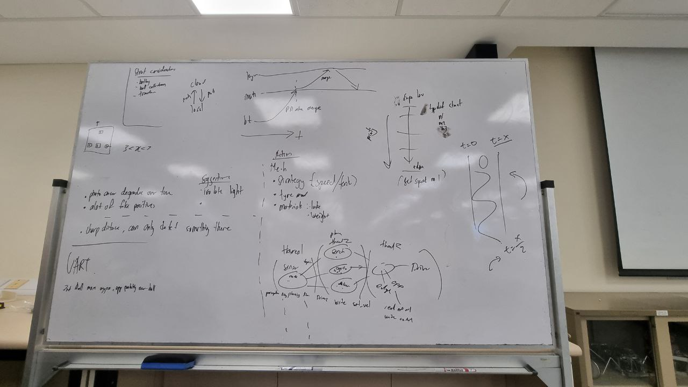

# Meeting Minutes

## Robot SW Notes

1. Use of one big super loop containing all the functions - Search, Go, Collect & Deposit
    - set priority for edge and opponent detection

2. Consider use of interrupt/multi-threading
    - multi-threading for continuous edge detection
    - can consider using interrupt when robot is stuck

3. Ball detection
    - can start a timer upon first detection of ball --> rotate the robot until the second sensor detects the ball --> stop timer
    - use the time recorded to position the tennis ball in the middle of the robot 
    - can consider use of PID to optimise robot movement towards the tennis ball (however maybe code intensive)

4. ROS System
    - Sensors
        - check all input received (opponent/tennis ball location, arena and line detection)
    - Processing
        - based on the inputs, what instructions should be carried out?
            - avoid opponent/barricade (reverse robot)
            - go to tennis ball
    - Actuator
        - execute instruction determined

Meeting Images

