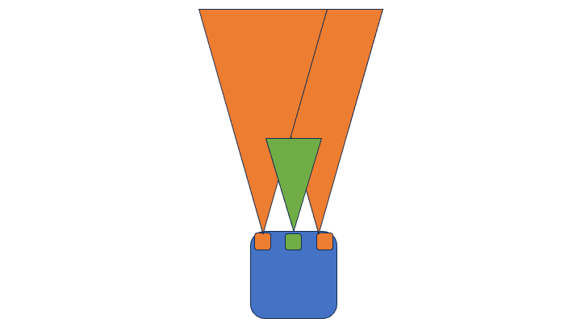
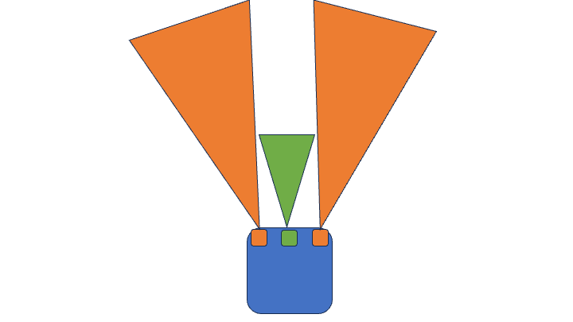
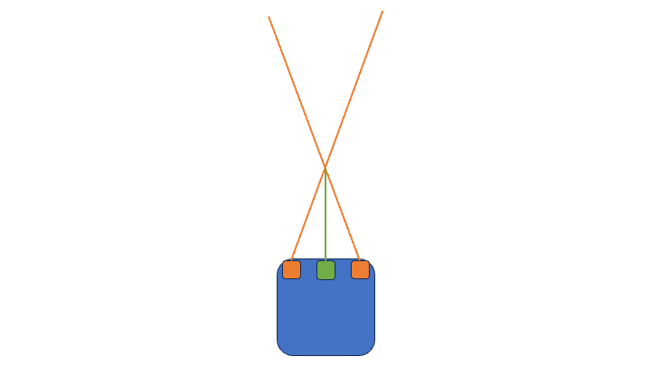
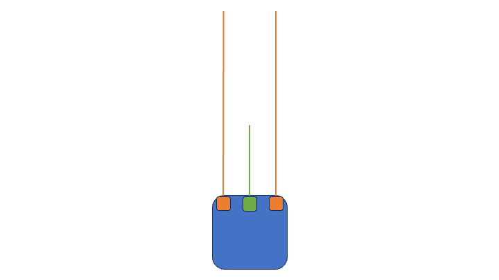
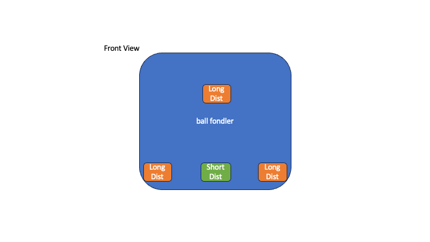
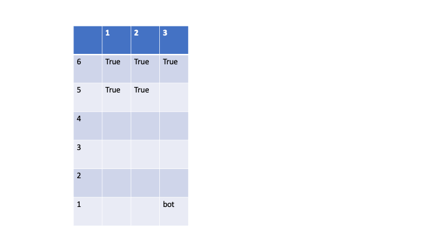
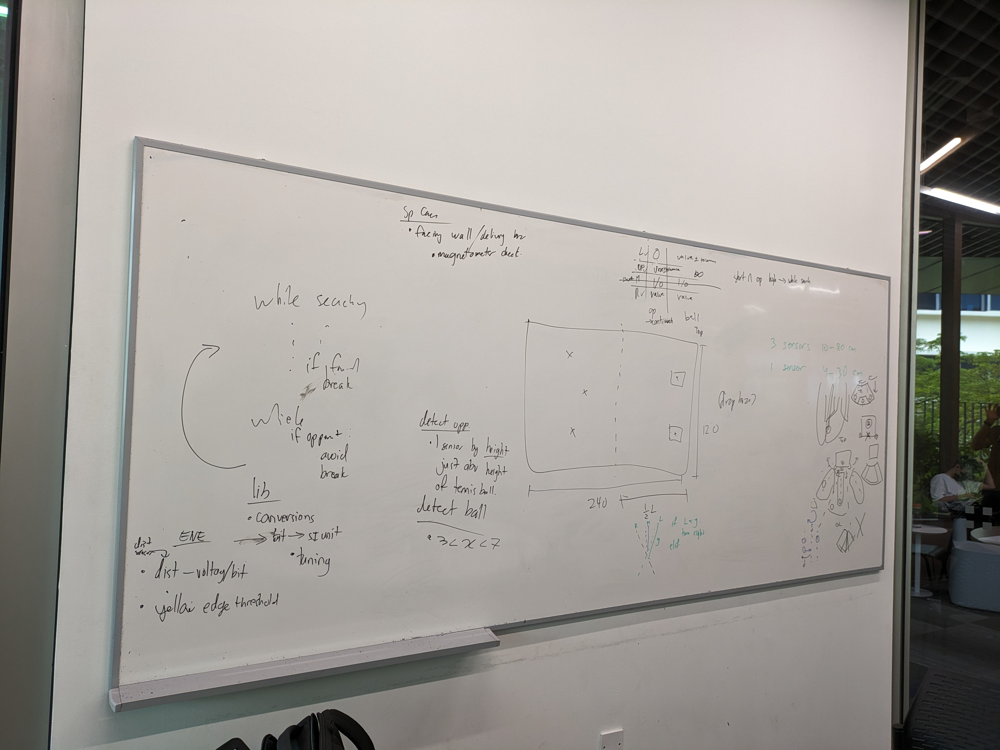

# Meeting Minutes

## Robot SW functions

- Each function will run in it's own while loop with checks to break of the loop.
- Edge detecting will run in each while loop and will take precedance over the function. This is done by abstracting the avoidance feature into a function.
- A library that converts raw data from sensors into SI units needs to be made so that troubleshooting is easier.
- write code such that tunable parameters are easily found.

1. Search for Ball

   - go forward to a certain distance and start search

   1. find the direction of ball (3 < X < 7) [cm]
       
      1. Overlapping Cone
          
         
         - Pros:
           - removes blind spots
         - Cons:
           - small view angle
      2. Non Overlapping Cone
          
         
      3. Crossed Line
          
         
      4. Straight Line
          
         
   2. Identify that it isnt an opponent [anything above 7cm]
      - if it is an opponent, continue search.
        

2. Mapping

   1. Map of mxn squares depends on our certainty in the position readings. Estimated ball position tracked as Bool True. The aim is to search the areas that the ball is most likely to be on the second pickup. The map is updatd with the ball positions where the Opponent sensor will be used to ommit some updats.
   2. The gobal position of the robot is reset when it touches a border. This is done by using the magenetometer and the location of the triggered sensor to determin which wall is touched.
      

3. Go to Ball

   1. Keep ball in the centerline of the robot.
      1. If ball on right, turn left. if ball on left turn right.
   2. Go straight

4. Collect Ball

   1. TBC
   2. Collection Failure goes back to searching

5. Deliver Ball
   1. orientates self with delivery mechanism to the wall and move back at full speed.
   2. trigger delivery system when 2 limit switches are triggered.
   3. failure cases:
      1. Stuck
         - detect by timeout
      2. Ball Escape
         - detech by chamber limit switch

## Meeting Pictuers

- 
- 
- 
- 
- 
- 
- 
- 
